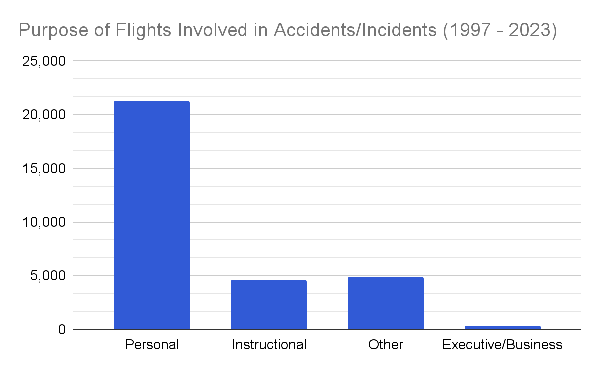
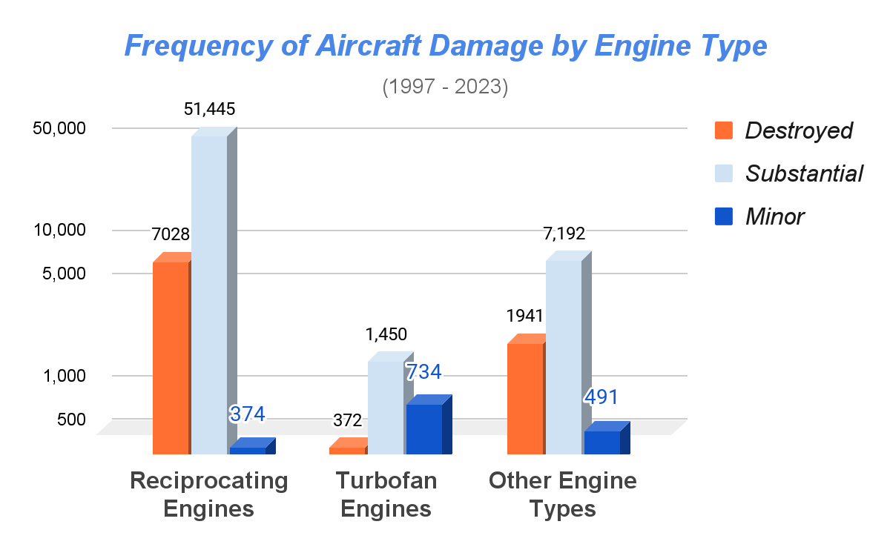
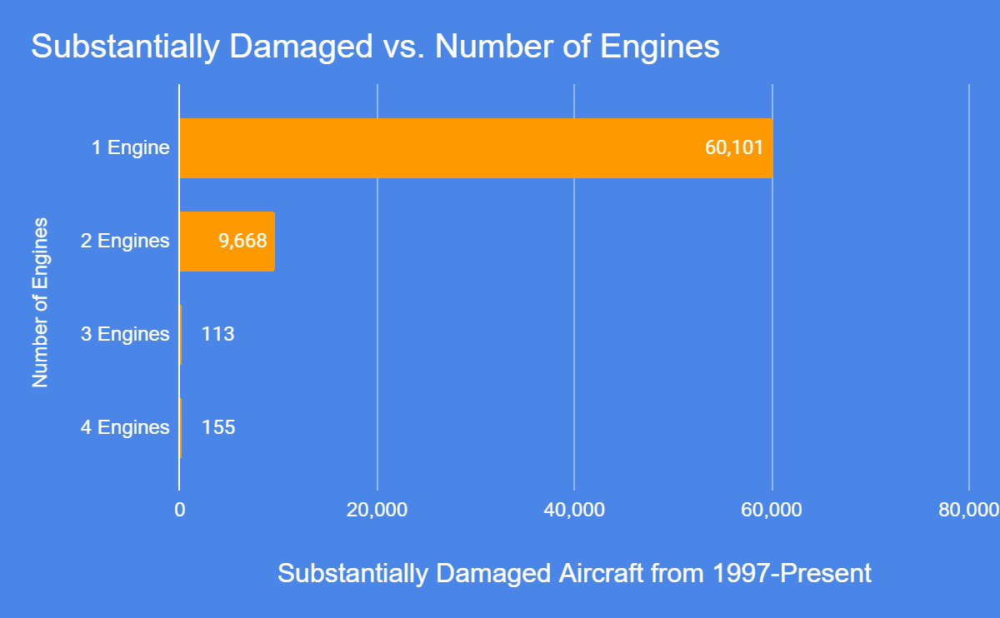
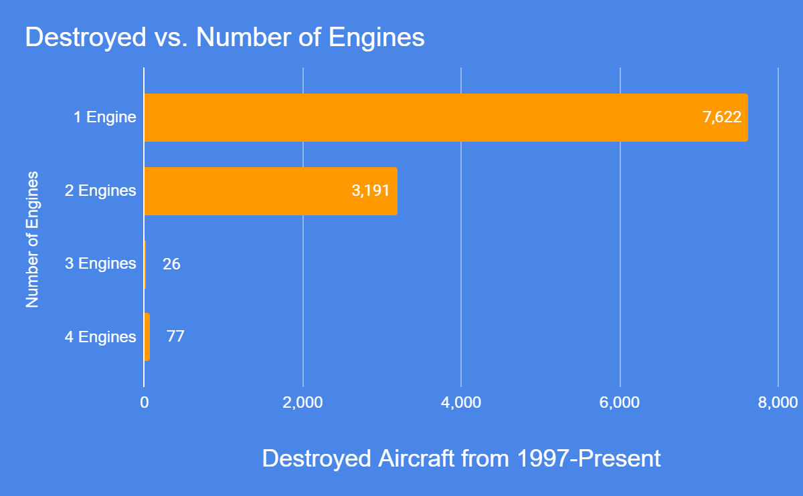
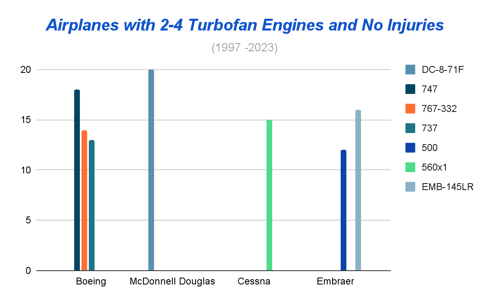

# FLY-HARD Aviation Risk Analysis

## Business Problem

We were tasked with analyzing data from the National Transportation Safety Board (NTSB) in order to provide three actionable insights to the head of aviation at FLY-HARD in order to help them decide the optimal aircraft to purchase for their new business venture. 

# Data Understanding

## Data Source

NTSB is the United States government entity responsible for investigating and publishing reports on every accident or incident involving civilian aircraft.

## Data Limitations

NTSB data is limited to civilian flights which have resulted in accidents involving personal injury or death, or in which the aircraft is substantially damaged; as well as incidents in which the operation of an aircraft affects or could affect the safety of operations.

This means we were without data points on the volume or flights or departures in which to contextualize our findings, so our analysis was limited to focusing on what would make for a more favorable outcome in the event of an aviation accident or incident. (Hereafter referred to broadly as an ‘event’.)

## Data Overview

The NTSB dataset contains records of every civilian aviation event from 1962 to the present. Every event is identified by a unique event ID and also contains at least one NTSB number (also known as an NTSB accident number). Most events involved only one aircraft, but some involved up to four and each had a slightly different NTSB number as well as an “Aircraft Key” in order to differentiate them. 

Note: NTSB changed their coding system after 2008 so there are slight differences in the data architecture.


# Data Analysis
## Methods

This project uses descriptive analysis to measure the factors which contribute to the increased frequency of aviation events, with special attention towards those that involve personal injuries or fatalities as well as substantial damage or destruction of an aircraft.

## Results

Personal and instructional flights are the riskiest.




Aircraft with reciprocating engines are more likely to be involved in an accident that involves substantial damage. Conversely, aircraft with turbofan engines are more likely to sustain only minor damage in the event of an accident or incident




Aircraft with only one engine suffer the most amount of damage in the event of an accident.





Passengers riding on aircraft with 2 - 4 turbofan engines are more likely to sustain no injuries in the event of an accident.



# Conclusion
<ul> 
<li><strong>Focus on executive and business audiences.</strong> Flights for business purposes are some of the least frequent types of flights that result in an aviation accident or incident.</li>
<li><strong>Limit your search to airplanes with turbofan engines.</strong></li>
<li><strong>Purchase airplanes with at least 2 - 4 turbofan engines.</strong></li>
</ul>

## Next steps

Further analysis to compare frequency of aviation events within the context of flight volume in order to calculate likelihood of an aviation accident or incident is recommended.

The ability to fly to locations not served by commercial airlines is a draw for corporate clients. An analysis of the risks involved in international private flights is also recommended.

## For more information 

<ul>
    <li>See the full analysis in the <a href="https://github.com/morgangoode/aircraftriskanalysis/blob/main/Aviation_Risk_Analysis.ipynb">Aviation Risk Analysis Jupyter Notebook</a>.</li> 
<li>Review our group project  <a href="https://github.com/morgangoode/aircraftriskanalysis/blob/main/Aviation_Analysis_Presentation.pdf">presentation</a>. </li>
<li>See the interactive dashboard on <a href="https://public.tableau.com/app/profile/simon.hui/viz/PHASE1_PROJECT/BarChart">Tableau Public</a>.</li>
</ul>

## Repository Structure

```
├── data
    ├── Kaggle_Aviation_Data.csv
    ├── Main_Dataset_1997_2023.csv
    ├── Main_Dataset_Taxonomy_Guide.xlsx
    ├── NTSB_tables
        ├── 1962-2008
        ├── 2008-2023
        ├── data-dictionaries-and-guides
    ├── filtered_dataframes
├── images
├── notebooks
├── Aviation_Risk_Analysis.ipynb
├── Aviation_Risk_Analysis_Presentation.pdf 
└── README.md
```
